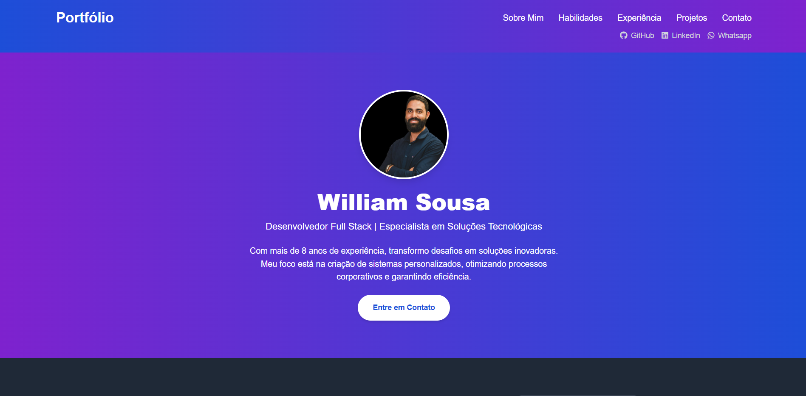
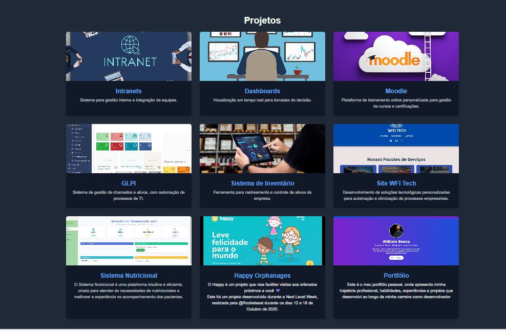

---
# 💻 **Portfólio Pessoal - William Sousa**

Este é o meu portfólio pessoal, onde apresento minha trajetória profissional, habilidades, experiências e projetos que desenvolvi ao longo da minha carreira como desenvolvedor Full Stack.

---

## 🚀 **Sobre o Projeto**

O objetivo deste projeto é criar uma plataforma digital que destaque minhas competências e projetos, com um design moderno e responsivo, pensado para oferecer uma ótima experiência ao usuário.

🔹 **Principais Funcionalidades:**  
- Apresentação profissional (Sobre Mim, Habilidades, Experiências).  
- Seção de projetos, detalhando cada um dos principais trabalhos.  
- Formulário de contato funcional.  
- Responsivo e otimizado para desktop e dispositivos móveis.

🔹 **Ferramentas Utilizadas:**  
- **HTML5** e **CSS3**  
- **TailwindCSS** para o design responsivo e estilização.  
- **JavaScript** para interatividade.

---

## 🎯 **Destaques Técnicos**

- **Design Responsivo:** Compatível com dispositivos móveis e desktops.  
- **Componentização:** Estrutura organizada para facilitar manutenção e expansão.  
- **Performance:** Código otimizado para rápido carregamento.

---

## 📸 **Preview**

### Página Inicial:  
  

### Seção de Projetos:  
  

*(Adicione screenshots reais do portfólio para deixar mais atraente.)*

---

## 🔧 **Como Rodar Localmente**

Siga os passos abaixo para rodar o projeto no seu ambiente local:

1. Clone este repositório:  
   ```bash
   git clone https://github.com/seu-usuario/portfolio.git
   ```

2. Entre no diretório do projeto:  
   ```bash
   cd portfolio
   ```

3. Abra o arquivo `index.html` diretamente no navegador ou use uma extensão para rodar com um servidor local.

---

## ✨ **Próximas Implementações**

- Adicionar versão multilíngue (Português e Inglês).  
- Melhorar SEO para melhor ranqueamento em motores de busca.  
- Integrar com APIs de estatísticas, como Google Analytics.

---

## 🛠 **Contribuições**

Sinta-se à vontade para contribuir com sugestões ou melhorias!

1. Faça um fork do repositório.  
2. Crie uma branch para sua feature:  
   ```bash
   git checkout -b minha-feature
   ```
3. Faça um pull request.

---

## 📞 **Contato**

Se você quiser falar comigo ou dar feedback sobre o portfólio:  
- **LinkedIn:** [https://www.linkedin.com/in/williamsousa-dev/](https://www.linkedin.com/in/williamsousa-dev/)  
- **Email:** williamdf2308@gmail.com

---
